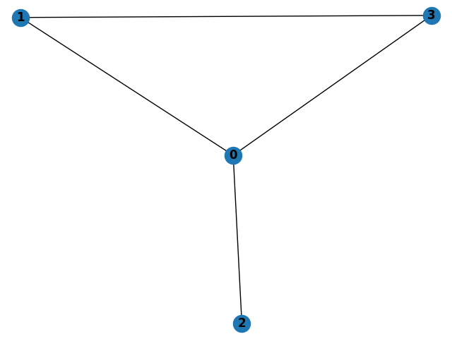
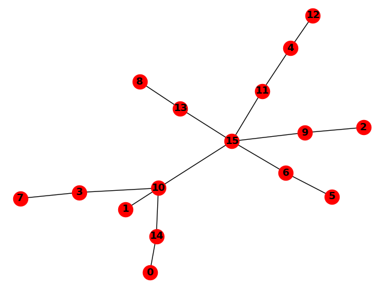
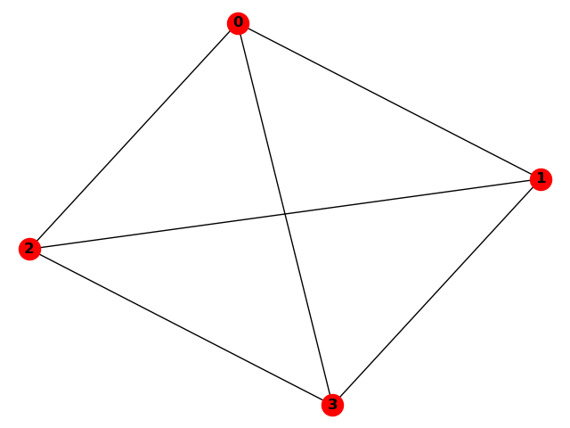
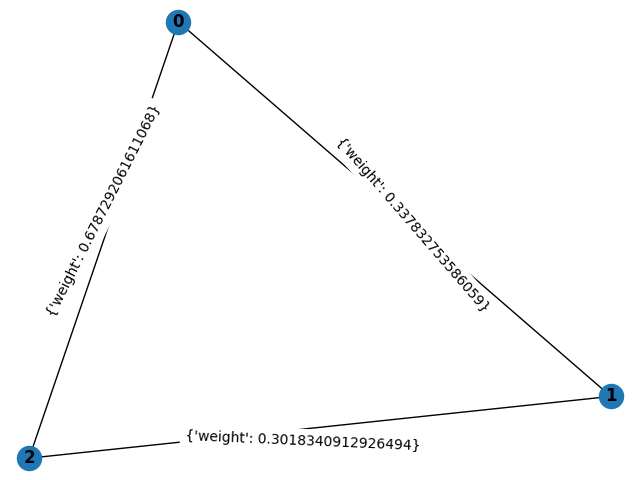
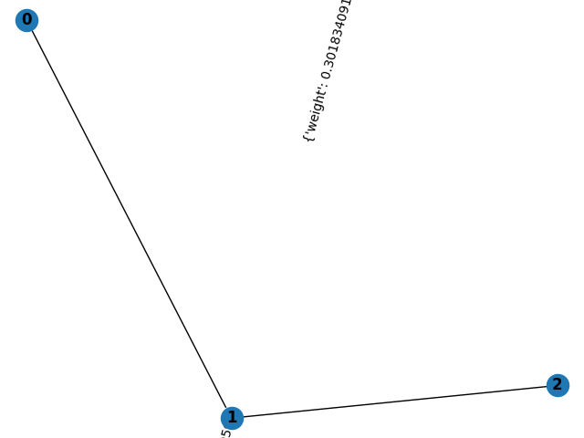
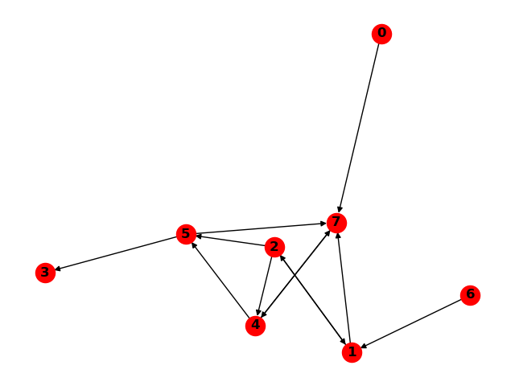

# Graph Algorithms in C
Prof. Yipeng Huang</br>
Rutgers University - New Brunswick</br>
2021 Spring</br></br>

# 0. Introduction and Setup
## Learning Goals
You will practice programming more complicated C programs. This includes using header files to organize your source code, using and building data structures, and using recursive function calls. At the same time, you will review and learn about important graph algorithms found throughout computer science.</br></br>

## Resources
Get started early! You can post questions to the class Piazza (please avoid sending emails to the TAs and instructor). You can discuss the assignment with your classmates, but you cannot copy code from your classmates. We will be checking the assignments for identical and/or plagiarized code using automated tools. See the academic integrity policy at: https://nbprovost.rutgers.edu/academic-integrity-students. We will report any violations.</br></br>

## Setup
The autograder script for this assignment needs two Python packages that you can easily install. Once you are logged into ilab, run the following command in any directory:

```
python -m pip install scipy networkx
```

</br>

Access the programming assignment files for this assignment by pulling new files from the class Github repository, 2021_0s_211:

```
git pull
```

If you do not have this directory already, clone the repository:

```
git clone https://github.com/yipenghuang0302/2021_0s_211.git
```

The files for this assignment are in the directory 2021_0s_211/pa2/.</br></br></br>

# 1. edgelist: Loading, Representing, and Printing an Undirected Unweighted Graph (easy) (22 points)
Graphs are fundamental data structures. A graph consists of nodes and edges connecting pairs of nodes. A basic kind of graph is an undirected, unweighted graph, meaning that the edges are not directional, and each edge doesn't have any additional properties. Here is an example of an undirected, unweighted graph G=(V,E), V={0,1,2,3}, E={(0,1),(0,2),(0,3),(1,3)} of four nodes and four edges:



There are several important ways to represent graphs.

The first graph representation is an [adjacency matrix](https://en.wikipedia.org/wiki/Adjacency_matrix). The adjacency matrix of the above graph is:

```
0 1 1 1 
1 0 0 1 
1 0 0 0 
1 1 0 0
```

The 0, 1, 1, 1 in the first row of the matrix indicates the 0th node is connected to the 1st, 2nd, and 3rd nodes, and so on.

The second graph representation is an [adjacency list](https://en.wikipedia.org/wiki/Adjacency_list). For a graph consisting of N nodes, the adjacency list data structure is an array of N separate linked lists for each node p, where each link in the linked list records a node q if the edge (p,q) exists. For example, the adjacency list representation of the above graph is:

```
0->1->2->3->/
1->0->3->/
2->0->/
3->0->1->/
```

The ->/ indicates a null pointer terminating the linked list.

The third graph representation is by listing the edges of the graph. For example, the edge list of the above graph is:

```
0 2
0 3
0 1
1 3
```

In the first part of this assignment, you will write a program that:

1. Loads an adjacency matrix representation of an undirected unweighted graph,
2. Holds that graph representation as a adjacency list data structure,
3. Prints out the edge list representation of the graph.</br></br>

## Input Format
Your program should take a single command line argument specifying the path to an input file. Test cases for your program are in the tests/ directory. In each test case, the first line records the number of nodes N in the graph. Then, the adjacency matrix is recorded in the subsequent N rows of the file.</br></br>

## Output Format
Expected outputs from your program for each test case are in the answers/ directory. You should print one line for each edge of the graph; each line should list the pair of nodes (separated by a space) constituting a graph edge.

This is an undirected graph, so the order of the nodes does not matter. The autograder will recognize re-ordering of the nodes as correct. The ordering of which edges are printed first also does not matter. The autograder will recognize re-ordering of the edges as correct.</br></br></br>

# How To Compile, Run, and Test Your Code
Instructions from Programming Assignment 1 carry over, with two important points.

First, an important C header file, graphutils.h, is provided to you in 2021_0s_211/pa2/graphutils.h. This file offers ready-to-use functions for loading a adjacency matrix, creating an adjacency list data structure, and freeing the adjacency list. You should call these functions to simplify your code.

Second, the autograder.py scripts for this assignment only work with Python version 2 on the ilab machines. This means that the correct way to invoke the autograder script is through either of these two commands:

```
./autograder.py
```

or

```
python2 autograder.py
```

</br></br>

# 2. isTree: Determining Whether an Undirected Graph Is a Tree Using Depth-First Search (medium) (22 points)
An undirected graph is a tree if and only if the graph contains no cycles. For example, this is a tree because it contains no cycles:



While this graph contains cycles and therefore is not a tree:



In this second part of the assignment, you will write a depth-first search through a graph to determine whether the graph contains cycle. A cycle is detected when depth-first search find a graph node that was already visited.</br></br>

## Input Format
Your program should take a single command line argument specifying the path to an input file. Test cases for your program are in the tests/ directory. In each test case, the first line records the number of nodes N in the graph. Then, the adjacency matrix is recorded in the subsequent N rows of the file.</br></br>

## Output Format
You should print "yes" if the graph is a tree, "no" if the graph is not a tree. Expected outputs from your program for each test case are in the answers/ directory.</br></br></br>

# 3. solveMaze: Finding the Shortest Path Through a Maze With Cycles Using Breadth-First Search (hard) (22 points)
In this third part of the assignment, you will write a program to find a shortest path in a graph from a source node to a destination node using breadth-first search. The graph representing the maze may contain cycles, so it is important avoid revisiting nodes that have already been visited.

Many important problems in artificial intelligence, robotics motion planning, and self-driving cars boil down to solving mazes on graphs. In classes such as AI and robotics, you will learn about advanced algorithms for solving mazes using heuristics (or guesses) that minimize search time.</br></br>

## Input Format
Your program should take TWO command line arguments. The first argument specifies the path to an input file describing a graph like previous portions of this assignment. The second argument specifies the path to an input file describing a query. The first line of the query file specifies the source node where you begin your search. The second line of the query file specifies the target node you want to reach.</br></br>

## Output Format
You should print a list of edges that, taken together, connect the source node to the target node in the graph. Again, the ordering of the nodes in each edge does not matter. The ordering of the edges does not matter. The autograder will check to see if you give a minimal set of edges that connect the source and target nodes.</br></br></br>

# 4. mst: Finding the Minimum Spanning Tree of a Undirected Weighted Graph (medium) (22 points)
A weighted graph is a graph that has a numerical weight property on each edge. The minimum spanning tree (MST) of an undirected weighted graph is a tree that connects all nodes in the graph, and at the same time minimizing the sum of the weights of the tree's edges. Many important problems in computer networking and operations research boil down to finding MSTs on graphs. As an example, this is a undirected weighted graph:



And this is its MST:



The edges (0,1) and (1,2) connects all nodes in the graph, and picking these edges minimizes the total weight of the tree. If all the weights in an undirected weighted graph are unique, then the MST is also unique, meaning everyone will find the same MST for a given graph.

In this fourth part of the assignment, you will write a program implementing a greedy algorithm to find the MST. Several algorithms solve this problem, but [Prim's algorithm](https://en.wikipedia.org/wiki/Prim%27s_algorithm) is likely the easiest to implement.</br></br>

## Input Format
Your program should take a single command line argument specifying the path to an input file. Test cases for your program are in the tests/ directory. In each test case, the first line records the number of nodes N in the graph. Then, the adjacency matrix is recorded in the subsequent N rows of the file. This time, the adjacency matrix contains floating point numbers. 0.0 indicates no edge between two nodes. Any other value indicates an edge with the given value as the edge weight.</br></br>

## Output Format
Expected outputs from your program for each test case are in the answers/ directory. You should print a list of edges that, taken together, form the MST of the input graph. Again, the ordering of the nodes in each edge does not matter. The ordering of the edges does not matter.</br></br></br>

# 5. findCycle: Finding a Cycle in a Directed Graph Using Depth-First Search (hard) (22 points)
A directed graph is a graph where edges are directional; that is, edges (p,q) and (q,p) are distinct. An important class of directed graphs are directed acyclic graphs (DAGs), which have broad applications in programming languages and compilers. A DAG is any directed graph with no cycles. For example, this is a directed graph:



The above graph is not a DAG because it contains cycles. The cycles are:

```
1 2 
4 7 
4 5 7
``` 

By extension, these rotated versions are also valid cycles of the above graph:

```
2 1 
7 4 
5 7 4 
7 4 5
``` 

In this fifth and final part of the assignment, you will bring together ideas you have used throughout this assignment to find and print a cycle in a directed graph. If no cycles are found, your program will report that the graph is a DAG. You can use any algorithm for this task; either the DFS or the BFS approaches you have used in this assignment so far can be useful.</br></br>

## Input Format
Your program should take a single command line argument specifying the path to an input file. Test cases for your program are in the tests/ directory. In each test case, the first line records the number of nodes N in the graph. Then, the adjacency matrix is recorded in the subsequent N rows of the file. This time, the adjacency matrix represents a directed graph.</br></br>

## Output Format
You should print a single line of nodes (separated by spaces) that forms a cycle in the input directed graph. For example, for the example directed graph above you can print any one of the seven cycles listed above. This time, the ordering of the nodes does matter as this is a directed graph. If no cycles were found, your program should print "DAG". The known cycles for each test case are in the answers/ directory. You can print out rotated versions of the known cycles; the autograder will see that rotated cycles are equivalent.</br></br>

## Hint
Suppose you enter the graph from 0, and find a cycle by following the path

```
0->7->4->5->7
```

Upon seeing 7 again, you know you have detected a cycle. You have to carefully determine where the cycle begins and ends in the path you have traversed.</br></br></br>

# How To Submit
From the pa2/ directory, you can run this command to check on the outputs of our autograder script.

```
./assignment_autograder
```

or

```
python2 assignment_autograder.py
```

</br>

When you are ready to submit, from the 2021_0s_211/ directory where you see the pa2/ directory, run this command:

```
tar cvf pa2.tar pa2/
```

Upload the file pa2.tar here on Canvas.

By submitting your assignment, you are agreeing to the Rutgers Honor Pledge: “On my honor, I have neither received nor given any unauthorized assistance on this examination assignment.”

We will not be accepting late assignments. The Canvas submission site will close to enforce the deadline, so be sure to submit early.

If anything is not clear, reach out to your classmates and the instructors on the class Piazza!